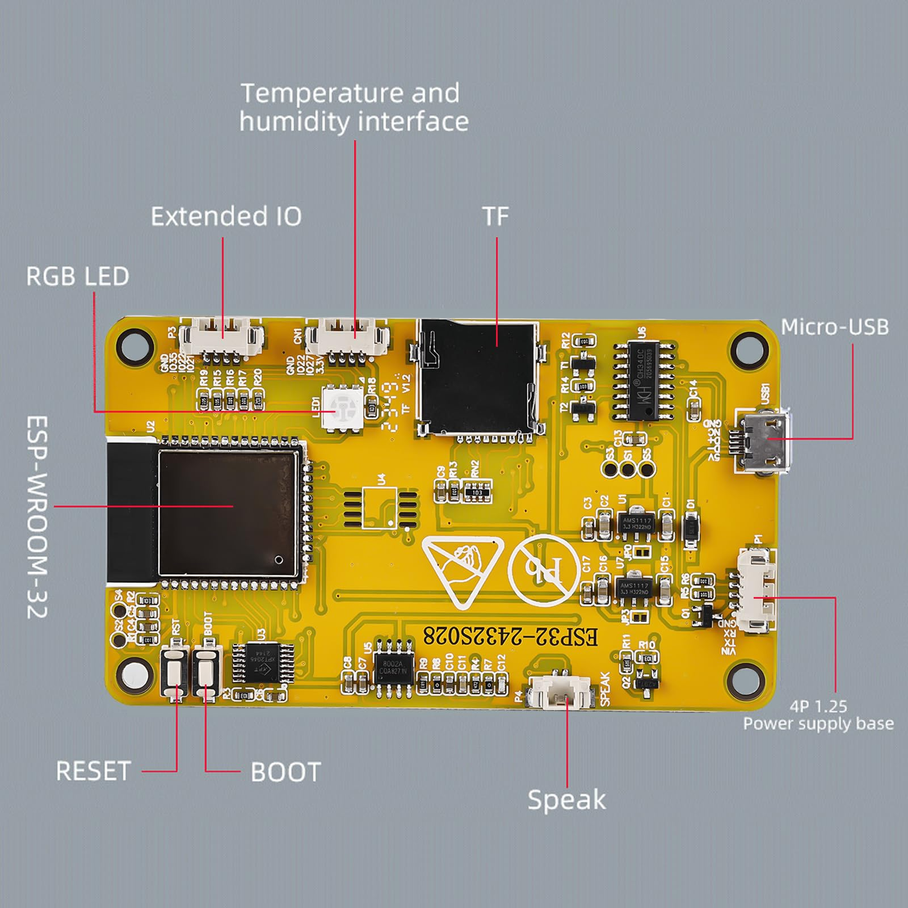

# PFG LCD (ESP32-2432S028R) Design

 
 

## Overview

The **ESP32-2432S028R** is a 2.8" TFT display designed for various embedded applications. It runs on **ESP32** with **FreeRTOS** and **ESP-IDF v5.x**, offering a solid foundation for your PFG project.

### Key Features:
- **2.8" TFT Display**: High-quality graphics rendering for your application.
- **FreeRTOS**: Lightweight and real-time OS for managing tasks efficiently.
- **ESP32 MCU**: Dual-core processor with Wi-Fi and Bluetooth capabilities.
- **ESP-IDF v5.x SDK**: Development environment for building custom firmware.

---

### See also:
* 📁 [ESP32-2432S028R Original Example Repo](https://github.com/limpens/esp32-2432S028R) – Check out the original example code and setup instructions.
* 📁 [CYD GitHub Repository](https://github.com/witnessmenow/ESP32-Cheap-Yellow-Display/tree/main) – Explore more resources, tips, and guides on working with this board.

---

## Project Structure

Here's how the project is structured:

PFG_LCD_ESP32/ 
├── CMakeLists.txt # Project build configuration file 
├── components/ # Custom components for the project 
│ ├── display_driver/ # Display control code 
│ └── touch_controller/ # Touchscreen management 
├── main/ # Main application folder 
│ ├── app_main.c # Main entry point of the application 
│ ├── display_task.c # Task responsible for display rendering 
│ └── touch_task.c # Task responsible for touch input handling 
├── include/ # Header files 
│ ├── display.h # Header for display functions 
│ └── touch.h # Header for touch functions 
└── README.md # Project documentation

### Description of key files:

- **CMakeLists.txt**: Contains the build configuration and dependencies for the project.
- **components/display_driver/**: Includes the driver code for the ESP32 TFT display. This handles all the low-level drawing, initialization, and updates to the screen.
- **components/touch_controller/**: Contains the logic to manage touch inputs, interpreting gestures and touch events.
- **main/app_main.c**: This file serves as the entry point for the application, initializing tasks and configuring FreeRTOS.
- **main/display_task.c**: Manages display-related tasks, including rendering the user interface and updating the screen.
- **main/touch_task.c**: Handles the interaction with the touchscreen, processing touch inputs to control the UI.

---

## Usage

You can use this display in a variety of applications, from **home automation** to **interactive kiosks**, where the **ESP32** handles communication and control while rendering real-time data on the screen.

---

## Design Diagram:

  
*Illustration of the wiring and setup for the ESP32 with the LCD screen.*